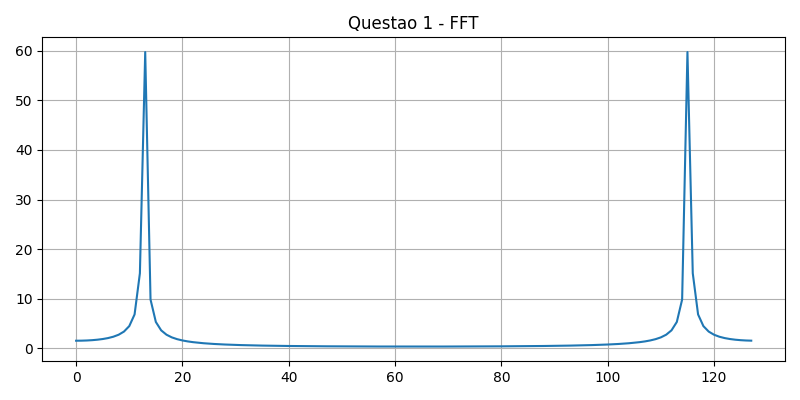

# Processamento Digital de Sinais - FFT e Análise Espectral

## Objetivo

Desenvolver simulações computacionais em MATLAB/SciLab para análise espectral de sinais discretos utilizando FFT.

---

## Estrutura do Projeto

- `/teoria` → Fundamentação teórica e discussões
- `/simulacoes` → Códigos MATLAB/SciLab
- `/resultados` → Gráficos e espectros obtidos

---

## Questões Desenvolvidas

1. FFT de senoide discreta
2. Soma de senoides
3. Aliasing
4. Janelamento
5. FFT com ruído
6. Implementação da DFT
7. Resposta ao impulso
8. Resolução espectral
9. Harmônicos
10. Análise espectral de sinal real

---

## Exemplo de Resultado

  

---

## Tecnologias Utilizadas

- MATLAB
- SciLab
- FFT
- Processamento Digital de Sinais

---

## Autor

Wagner Gabriel Oliveira da Silva

IFPB - Processamento Digital de Sinais
